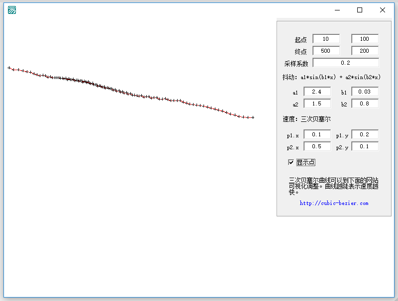
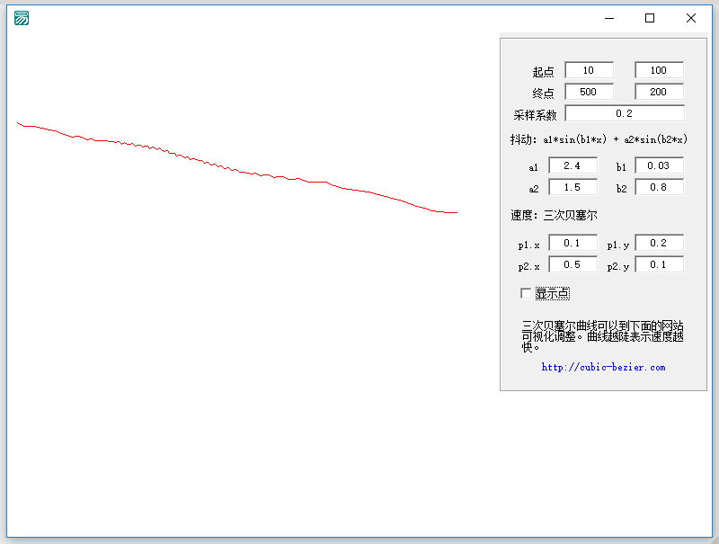
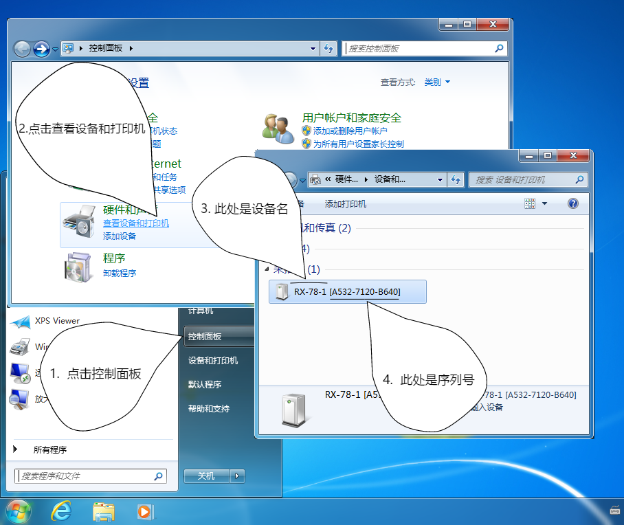

# 常见问题

## 各种鼠标模式有什么区别？使用相对模式时鼠标可以移动到绝对坐标吗？
设备可以配置为相对、绝对、相对+绝对三种模式，使用这三中模式时都可以进行相对和绝对移动。使用相对模式时，将使用相对移动模拟绝对移动；使用绝对模式时将使用绝对移动模拟相对移动；相对+绝对模式不使用模拟。

模拟是在接口库内部记录每次移动的值实现的，使用前需要先重置光标，若目标机器的鼠标被外部程序等移动时，需要再次重置光标。

使用相对模式时，查看系统设备可以看到 1 一个相对坐标的鼠标设备；绝对模式是 1 个绝对坐标的鼠标设备；绝对+相对是 1 个绝对坐标鼠标设备和 1 个相对坐标鼠标设备，一共 2 个设备。

硬件默认是使用相对模式，模式可以自行配置，配置后需要重启设备或重新插拔设备。

## 可配置抖动和速度变化的鼠标轨迹是什么意思？
接口库提供的轨迹移动不同于市面商其他库的模拟，仅仅是匀速平滑地移动，而是可以通过多个参数控制轨迹的速度变化和抖动。下图是用于配置参数的程序，点与点之间的延迟是相等的，所以越密的部分速度越慢。调用时可以配置
 a1、b1、a2、b2、p1.x、p1.y、p2.x、p2.y 的范围、点之间的延迟、采样系数（起点到终点的距离 * 采样系数 = 点的数量），从而得到非常自然的轨迹（如果觉得麻烦，可以直接采用默认值）。

## 使用 VID+PID 的方式打开设备失败
请先确认设备的 ID，注意 ID 都是十六进制的。

## 如何查看设备名和序列号
### Windows 10 用户

### Windows 7 用户

