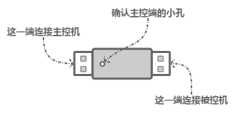
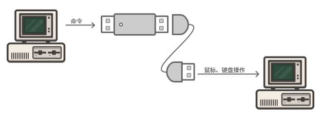
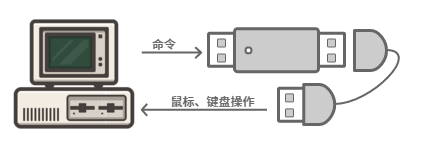
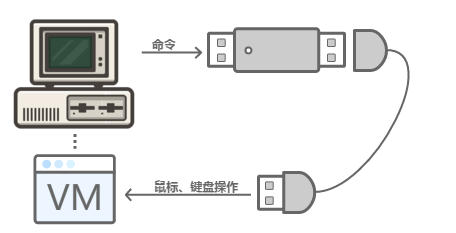
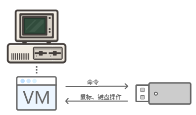

# 介绍

RX-78 盒子是 USB HID 设备，软件发送命令到盒子后，设备将执行鼠标或键盘操作，可用于自动操作或使用 USB 接口操作其他机器。

具有如下特点：

1. 无需安装驱动，即插即用
2. 键盘支持全键盘、组合键操作，可以支持 6 + 8 个无冲突按键：
  - 8 个控制按键：左/右Ctrl、左/右Shift、左/右Alt、左/右 Windows
  - 6 个除了以上 8 个控制按键外的普通按键
3. 支持修改VID、PID、设备名
4. 支持写入和验证数据
5. 支持鼠标绝对坐标移动

盒子分为单头和双头两种，都通过同一个接口库 RX-78.dll 进行操作。

## 双头盒子
双头盒子从主控机的 USB 接收的命令传给被控机，被控机通过 USB 执行键盘或鼠标操作。

可以使用 USB 延长线，将双头盒子连接到主控机和被控机上。

主控机和被控机可以是同一台机器。

也可以将双头盒子的被控端映射入虚拟机中，实现主机控制虚拟机。

## 单头盒子

单头盒子只使用一个 USB 接口，接收本机的命令后执行键盘或鼠标操作。
使用单头盒子时，相当于将双头盒子的两端都插到同一台机器上。

单头盒子也可以将设备映射入虚拟机中，此时，控制程序也必须在虚拟机中。

## 接口库
接口库是程序操作盒子的编程接口，同时包装了很多常用的操作，包括：鼠标单击、双击、可配置的模拟鼠标移动操作、按键等，详见各 [API 说明](API.md)。

接口库是通过一个 x86 win32 dll 文件实现，同时支持单头盒子以及双头盒子。函数使用 stdcall 调用协议，目前只直接提供易语言模块和 VC++ 的动态链接库 lib，实际上任何支持调用 win32 dll 的语言都能开发，包括按键精灵、VB、VB.NET、C#、Delphi、Python、JAVA、按键精灵、TC 等。