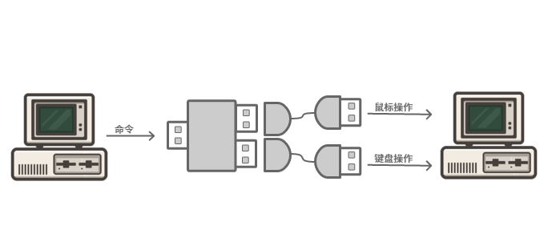

# 介绍

RX-78 是一款 USB HID 设备，软件发送命令到设备后，设备将执行鼠标或键盘操作，可用于自动操作或使用 USB 接口操作其他机器。

当前软件开发工具包版本为 [v2.3.5](SDK.md#v2.3.5)。

[淘宝购买链接](https://item.taobao.com/item.htm?id=587354844866)

具有如下特点：

0. 无需安装驱动，即插即用
1. 键盘支持全键盘、组合键操作，可以支持 6 + 8 个无冲突按键：
  - 8 个控制按键：左/右Ctrl、左/右Shift、左/右Alt、左/右 Windows
  - 6 个除了以上 8 个控制按键外的普通按键
2. 支持修改厂商ID（vendor id）、产品ID（product id）、设备名、制造商、修订号
3. 支持写入和验证数据
4. 可配置鼠标为相对、绝对、相对+绝对三种模式中的一种。[详细区别](QNA.md#各种鼠标模式有什么区别？使用相对模式时鼠标可以移动到绝对坐标吗？)
5. 支持中英文输入
6. 可配置抖动和速度变化的鼠标轨迹。[效果查看](QNA.md#可配置抖动和速度变化的鼠标轨迹是什么意思？)
7. 已提供易语言模块、VC++ 的动态链接库、TC 接口、Python 3.6 接口、COM 接口（按键精灵、TC、delphi 等都可以直接调用）
8. 支持使用设备序列号或 PID+VID 两种方式打开设备。[如何查看设备序列号](QNA.md#如何查看设备名和序列号)
9. 设备分为 1 头、2 头和 3 头，都通过同一个接口库进行操作，更换设备无需更改代码

注意：接口库不支持 Windows XP，Visual Studio 也尽量使用新版本。

## 双头设备
双头设备从主控机的 USB 接收的命令传给被控机，被控机通过 USB 执行键盘或鼠标操作。

可以使用 USB 延长线，将双头设备连接到主控机和被控机上。

主控机和被控机可以是同一台机器。

也可以将双头设备的被控端映射入虚拟机中，实现主机控制虚拟机。

## 单头设备

单头设备只使用一个 USB 接口，接收本机的命令后执行键盘或鼠标操作。
使用单头设备时，相当于将双头设备的两端都插到同一台机器上。

单头设备也可以将设备映射入虚拟机中，此时，控制程序也必须在虚拟机中。

## 三头设备

三头设备从主控机的 USB 接收的命令传给被控机，被控机通过 USB 执行键盘或鼠标操作。

与双头硬件不同的是，三头硬件将鼠标和键盘分开为两个单独的设备。

## 接口库

接口库是程序操作设备的编程接口，同时包装了很多常用的操作，包括：鼠标单击、双击、可配置的模拟鼠标移动操作、按键等，详见各 [API 说明](API.md)。

接口库是通过一个 x86 win32 dll，同时实现了 COM 接口，支持 1 头、2 头和 3 头设备。目前已提供易语言模块、VC++ 的动态链接库、TC 接口和 Python 3.6 接口、COM 接口（按键精灵、TC、delphi 等都可以直接调用）。实际上任何支持调用 win32 dll 或 COM 的语言都能开发，包括VB、VB.NET、C#、JAVA等。